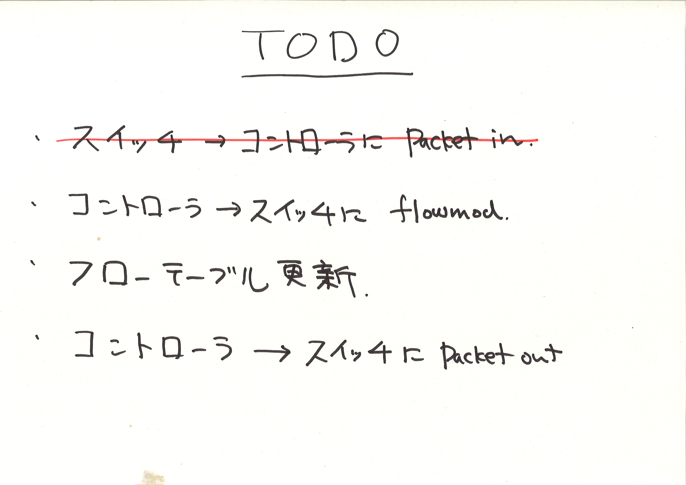

!SLIDE master
# イテレーション #3 ##############################################################
## "Packet-in"

!SLIDE full-page-image

!SLIDE bullets small incremental
# テストの整理 #################################################################

* スイッチ 1 台、ホスト 3 台があったとき (<i>Given</i>)、
* ホスト 1 が ホスト 2 にパケットを送ると (<i>When</i>)、
* コントローラにスイッチからの packet_in が届く (<i>Then</i>)

!SLIDE smaller
# Expectation ##############################################################

	@@@ ruby
	describe RepeaterHub do
	  it "should flood incoming packets to every other port" do
	    network {
	      vswitch("switch") { dpid "0xabc" }
	
	      vhost("host1") { promisc "on" }
	      vhost("host2") { promisc "on" }
	      vhost("host3") { promisc "on" }
	
	      link "switch", "host1"
	      link "switch", "host2"
	      link "switch", "host3"
	    }.run(RepeaterHub) {
	      # スイッチ 0xabc から packet_in メッセージが一度だけ届くはず
	      controller("RepeaterHub").should_receive(:packet_in).with do |m|
	        m.datapath_id.should == 0xabc
	      end

	      send_packets "host1", "host2"
	    }
	  end
	end
	
	# => SUCCESS

!SLIDE smaller
# Don't Repeat Yourself

	@@@ ruby
	describe RepeaterHub do
	  around do |example|  # 共通処理をここに書く
	    network {
	      ...
	    }.run(RepeaterHub) {
	      example.run  # テストの実行
	    }
	  end
	
	  context "when host1 sends one packet to host2" do
	    it "should #packet_in" do
	      controller("RepeaterHub").should_receive(:packet_in).with do |m|
	        m.datapath_id.should == 0xabc
	      end
	
	      send_packets "host1", "host2"
	    end
	
	    it "should flood incoming packets to every other port" do
	      send_packets "host1", "host2"
	
	      pending( "あとで実装する" )
	      vhost("host2").stats(:rx).should have(1).packets
	      vhost("host3").stats(:rx).should have(1).packets
	    end
	  end
	
	# => SUCCESS

!SLIDE full-page-image

!SLIDE full-page-image

