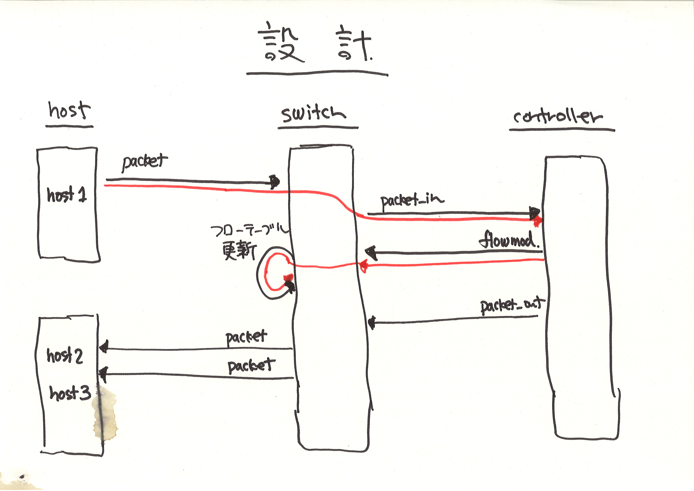

!SLIDE master
# イテレーション #4 ###################################################################
## "Flow-mod"

!SLIDE full-page-image

!SLIDE smaller
# 「コントローラは flow-mod を送る」 はず? ######################################################

	@@@ ruby
	it "should #send_flow_mod_add" do
	  controller("RepeaterHub").should_receive(:send_flow_mod_add).with do |dpid|
	    dpid.should == 0xabc
	  end
		
	  send_packets "host1", "host2"
	end
	
	# => FAIL!

!SLIDE
# flow-mod を打つ ######################################################################

	@@@ ruby
	class RepeaterHub < Trema::Controller
	  def packet_in message
	    send_flow_mod_add message.datapath_id
	  end
	end
	
	# => SUCCESS

!SLIDE small
# フローエントリ数を確認 ######################################################################

	@@@ ruby
	describe "switch" do
	  it "should have one flow entry" do
	    send_packets "host1", "host2"

	    switch("switch").should have(1).flows
	  end
	end
	
	# => SUCCESS

!SLIDE small
# フローエントリの中身を確認 ###################################################################

	@@@ ruby
	describe "switch" do
	  it "should have one flow entry" do
	    send_packets "host1", "host2"

	    switch("switch").should have(1).flows
	    switch("switch").flows.first.actions.should == "FLOOD"
	  end
	end
	
	# => FAIL!

!SLIDE small
# ちゃんと flow_mod を打つ ##################################################################

	@@@ ruby
	def packet_in message
	  send_flow_mod_add(
	    message.datapath_id,
	    # マッチ、バッファ ID、アクションを指定
	    :match => Match.from(message),
	    :buffer_id => message.buffer_id,
	    :actions => ActionOutput.new(OFPP_FLOOD)
	  )
	end
	
	# => SUCCESS

!SLIDE full-page-image

!SLIDE full-page-image

