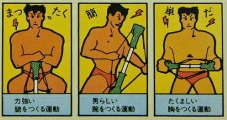

!SLIDE center

# リピータハブを作ろう ##########################################################

## Trema チュートリアル

 

## 高宮 安仁
## 2011 年 6 月 9 日

 
 

!SLIDE bullets incremental
# 誰ですか? ###############################################################

* 高宮 安仁 (たかみや やすひと)
* [@yasuhito](http://twitter.com/#!/yasuhito)
* HPC, クラスタ、 グリッド、 クラウドを少々
* OpenFlow フレームワーク [Trema](https://github.com/trema/trema)

!SLIDE bullets incremental
# ゴール #################################################################

* Trema でリピータハブを作りながら、
* Trema の OpenFlow フレームワークを紹介

!SLIDE bullets incremental
# Trema フレームワーク? #####################################################

* ネットワーク DSL
* テストフレームワーク
* Trema Ruby ライブラリ
* ... とりあえず Trema をセットアップ

!SLIDE commandline
# セットアップ ##############################################################

	@@@ commandline
	$ git clone git://github.com/trema/trema
	$ ./build.rb
	  (There is no Step Three!!)

!SLIDE full-page-image

!SLIDE 
# では、
# さっそくリピータハブを作ろう
