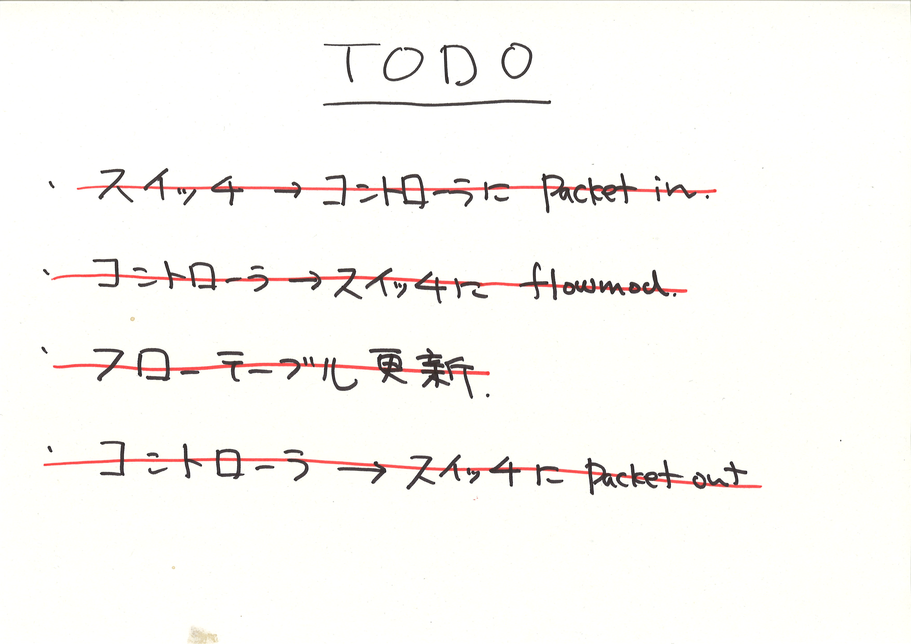
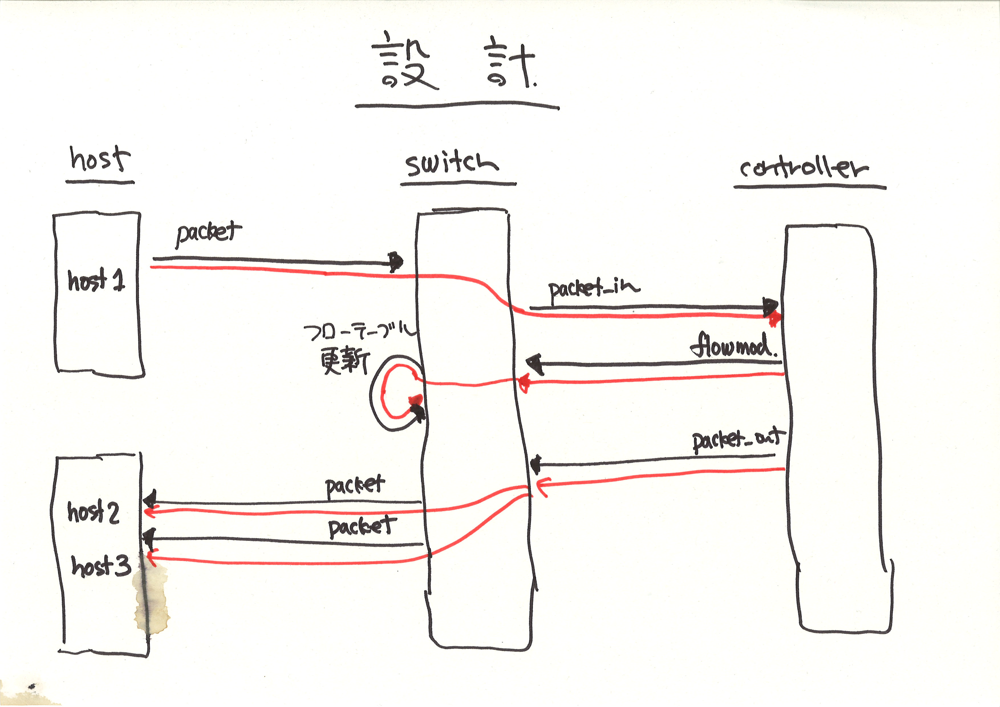

!SLIDE master
# イテレーション #5 ##################################################
## "Packet-out"

!SLIDE small
# 宛先にパケットが届いてるか？ ##########################################

## pending にしていたテストを復活

	@@@ ruby
	describe "host" do
	  it "should receive packets" do
	    send_packets "host1", "host2"
	
	    vhost("host2").stats(:rx).should have(1).packets
	    vhost("host3").stats(:rx).should have(1).packets
	  end
	end
	
	# => FAIL!

!SLIDE smaller
# パケットアウトしよう

	@@@ ruby
	class RepeaterHub < Trema::Controller
	  def packet_in message
	    send_flow_mod_add(
	      message.datapath_id,
	      :match => Match.from(message),
	      :buffer_id => message.buffer_id,
	      :actions => ActionOutput.new(OFPP_FLOOD)
	    )
	    # 追加
	    send_packet_out(
	      message.datapath_id,
	      message.buffer_id,
	      message.in_port,
	      ActionOutput.new(OFPP_FLOOD),
	      message.data
	    )
	  end
	end
	
	# => SUCCESS

!SLIDE full-page-image

!SLIDE full-page-image

!SLIDE master
# できた! (?)
